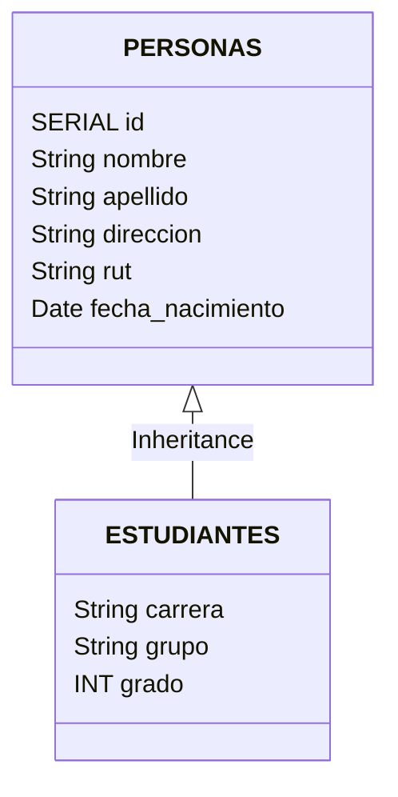

La entrada es breve y se actualizará en la marcha. 

## Expresiones regulares como restricción

Considerando que no queremos ingresar "basura" a nuestra DB, es que usaremos regexp para filtrar el posible ingreso de data basura. En este caso se considera el rut chileno con la expresión regular `/^(\d{1,3}(?:\.\d{1,3}){2}-[\dkK])$/gm` para su validación



Con la instrucción `CHECK(rut ~ '^(\d{1,3}(?:\.\d{1,3}){2}-[\dkK])$')` podremos dar la validación en base a un regexp

```sql
CREATE TABLE personas (
id SERIAL PRIMARY KEY,
nombre VARCHAR(30) NOT NULL,
apellido VARCHAR(30),
direccion VARCHAR(50),
rut VARCHAR(20) NOT NULL UNIQUE CHECK(rut ~ '^(\d{1,3}(?:\.\d{1,3}){2}-[\dkK])$'),
fecha_nacimiento DATE
);
```

```sql
CREATE TABLE estudiantes (
carrera VARCHAR(50) NOT NULL,
GRUPO VARCHAR,
GRADO INT,
) INHERITS (personas);
```
